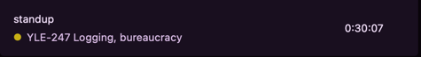
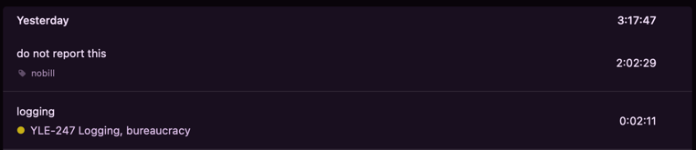

# toggltempo

[](https://badge.fury.io/py/toggltempo)

Synchronises time entries from [Toggl Track](https://toggl.com/) or a text file into
the [Tempo Timesheets](https://marketplace.atlassian.com/apps/6572/timesheets-by-tempo-jira-time-tracking?tab=overview&hosting=cloud)
Jira plugin.

## Requirements

- Python 3.9+
- `pip`

## Installation

```bash
$ pip install toggltempo
```

### Upgrading to latest version

```bash
$ pip install -U toggltempo
```

## Usage

### Configuration

When `toggltempo` is executed for the first time, a blank configuration file is created and instructions are given on
what configuration is required:

```
$ toggltempo
Config file not found: "/Users/melka/.config/toggltempo.yaml"
The configuration file has been created now. Fill in the required options there.

For Jira Tempo Timesheets
  - Find your Jira user ID by clicking your user avatar in Jira UI and going to Profile. The ID will be in the address bar.
  - Create an API token at "https://YOUR-WORKSPACE.atlassian.net/plugins/servlet/ac/io.tempo.jira/tempo-app#!/configuration/api-integration".'

For Toggl Track
  - Enter your e-mail and password to the Toggl Track service
  - This is only needed if submitting data through the Toggl Track API. Leave it empty if submitting file-based data.
```

### Import time entries from Toggl Track

When executed without any arguments, `toggltempo` will import the previous working day's time entries into Tempo:

```bash
$ toggltempo
Argument DATE not provided.
Assuming you want to log hours for yesterday: "2023-11-13"
Is that OK? You will be prompted again before sending any time logs, no worries. (y to confirm): y
Reading entries from Toggl API
Will log the following entries into date "2023-11-13":

  - 2023-11-13 | OPS-1433   | 0:20:51    | Foobar
  - 2023-11-13 | RH-8661    | 5:10:58    | Lorem
  - 2023-11-13 | FEN-1644   | 0:54:38    | Ipsum
  - 2023-11-13 | FEN-1518   | 1:47:46    | Something other
  - 2023-11-13 | OPS-1433   | 0:14:11    | Very important work
  - 2023-11-13 | FEN-1518   | 0:41:44    | Slacking off
  - 2023-11-13 | YLE-247    | 1:02:50    | I dont even know
  - 2023-11-13 | FEN-1683   | 0:19:23    | About time
  - 2023-11-13 | YLE-247    | 0:26:30    | I am done

Total time: 10:58:51

Is that OK? (y to confirm): y
  OPS-1433 ✅
  RH-8661 ✅
  FEN-1644 ✅
  FEN-1518 ✅
  OPS-1433 ✅
  FEN-1518 ✅
  YLE-247 ✅
  FEN-1683 ✅
  YLE-247 ✅
All sent 🎉
```

If no argument is not provided, data from the previous workday will be used. Workdays are `MTWTF`, no consideration is
made for public holidays. When executed on Monday, sending data for Friday will be assumed. Otherwise, data from
yesterday will be assumed.

#### Toggl Track time entry format

When importing time entries from Toggl Track, a certain format is expected:

1. Each time entry MUST be assigned to a Project.
2. The Project name MUST be in format "RH-1234 Some freetext whatever".
   The first field of the project name (split by a whitespace) is expected to be the Jira issue ID.
   The rest of the project name is ignored. For convenience use
   the [Import](#import-jira-tickets-into-toggl-track-projects) command to create Toggl Track projects
   from Jira tickets.
3. Each time entry MUST contain a text description. This description will be used as the Jira Tempo
   worklog description.

When tracking entries in Toggl Track, it's useful to use the "@" shortcut to add a Project to
the currently tracked entry.

This is a correct entry:



#### Import time entries from an exact date

To send data for a particular date, pass the date as an argument in format `YYYY-MM-DD`:

```bash
$ toggltempo 2023-10-10
```

### Import Jira tickets into Toggl Track projects
In order to track time to Jira tickets in Toggl, there needs to be a Toggl Project for each Jira ticket. Use the 
`toggltempo --import XXX` command to save some work with copying over the Jira ticket summaries. 

```bash
$ toggltempo -i RH-9313   # [or --import RH-9313]
Going to create a Toggl Track project named:

  RH-9313 Refactor and remove PACE custom email rendering

Is that OK? (y to confirm): y
Project created in Toggl Track, you can now use it in time tracking 🛠️
```

You can of course not use this command and create the projects yourself, as long as they follow the required format.

### Import time entries from a local file

It is possible to import the time entries into Tempo Timesheets from a local file instead of Toggl Track API:

```bash
$ toggltempo --file somedir/2023-11-10
```

The file name **must** be in format `YYYY-MM-DD`. It is not possible to omit the file name (no automatic workday
calculation).

The file structure is:

```
# Comments
PROJ-123  1h5m Some description that may contain spaces
MISC-9876 5m First column is the Jira issue ID, second column is the time to log, and everything else will be the description
```

### Ignore time entries
To skip a time entry from being reported to Tempo, mark it with a `#nobill` tag.



```bash
$ toggltempo 2023-11-26
Reading entries from Toggl API
  - Skipping import of "do not report this (2:02:29)", because it is tagged with #nobill
Will log the following entries into date "2023-11-26":
...
```

## Development

```bash
$ python3 -m pip install twine build

$ python3 -m build
$ python3 -m twine upload dist/*
```
